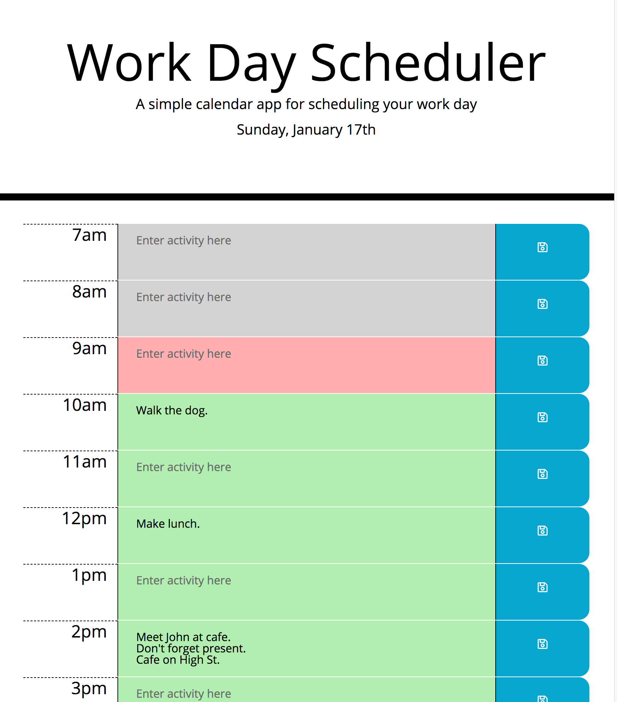

# Work Day Scheduler

## Aim: 

To create a simple calendar application that enables the userto save events for each hour of the day. The app runs in the browser and features dynamically updatd HTML and CSS powered by jQuery.

## Goals:

* Current day is displayed at the top of the calendar. This is dynamically updated each second to accurately reflect the current day and date. 

* Timeblocks for standard business hours are presented.

* When the user clicks on a timeblock, they can enter an activity (for that particular hour).

* Clicking the "save" icon stores the text for that event in local storage. 

Screenshot of the implemented Work Day Scheduler:

Link to deployed application:

https://blakestickland.github.io/work-day-scheduler/

## To be implemented in the future:

* Each timeblock is color coded to indicate whether it is in the past, present, or the future.

* When the page is refreshed, the saved activity entries persist.

